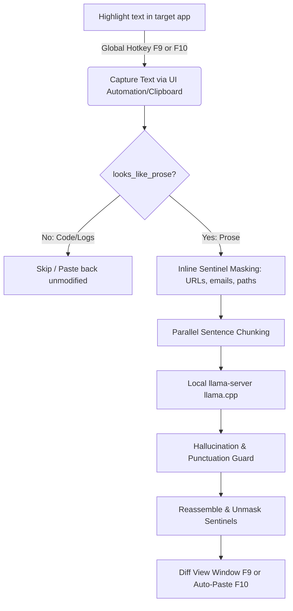

# Stet

  

  <strong>Stet</strong> is a local-first, privacy-respecting AI autocorrect and text rewriting utility for Windows. Select text in any desktop application, press a global hotkey, and instantly correct or rewrite it in place.

  
  
  
  
  

  <strong>Latest release: v1.1.0</strong> — <a href="https://github.com/AmrZriek/Stet/releases/tag/v1.1.0">Download Installer</a>

---

## 🔒 Why Stet?

Stet was built to solve the privacy dilemma of modern AI writing tools. Writing sensitive emails, corporate documents, or legal briefs in standard cloud-based utilities transmits your drafts over the network. Stet keeps everything local.

* **100% Offline & Private:** Powered by a local `llama.cpp` server. Your text never leaves your RAM or disk.
* **Context-Aware:** Unlike simple dictionary checkers, Stet understands full paragraphs, tone, and sentence structure.
* **Developer Friendly:** Automatically detects and skips code blocks, shell commands, and variables using structural heuristics.
* **No Cloud Overhead:** Bypasses API keys, subscription limits, and latency spikes.

---

## 🚀 How it Works

Stet runs in the background as a system tray app. When you press a global hotkey, the core pipeline executes:

---

## ✨ Features

* **4 Correction Strengths:**
  * 🏷️ **Spelling Only:** Fixes typos and basic spelling/grammar without altering style or flow.
  * 📝 **Full Correction:** Polishes punctuation, verb tense, prepositions, and phrasing.
  * ✨ **Rewrite & Polish:** Reworks sentence structure for better flow, vocabulary, and readability.
  * 🔧 **Custom Patch:** Allows you to input your own prompt instructions (e.g., "translate to Spanish", "make it formal").
* **Onboarding & Welcome Window:** A premium draggable welcome window on first boot with SVG technical flowcharts, interactive preset options, templates, and live diff output.
* **Native GUI Downloader:** Handles first-run downloading and verification of the recommended AI model and `llama.cpp` backend directly inside a native progress dialog, replacing CLI console terminals.
* **Interactive Correction Window:** Edit the corrected text, rerun custom templates, or chat directly with the local AI to refine the output.
* **Smart Selection Capture:** Reads highlighted text in the active window (supports terminal consoles, text editors, IDEs, and browser fields).
* **System Tray weight manager:** Unload model weights to free up system VRAM/RAM instantly, adjust settings, and monitor model status.
* **Security-Hardened Autoupdater:** Secure download verification via SHA-256 hashes, tag validation, and HTTPS enforcement.

---

## ⌨️ Keyboard Shortcuts

* **`F9`**: Open the Correction & Chat popup with the captured text.
* **`F10`**: Instantly correct selected text silently in the background and paste it back automatically.
* **`Enter`** (inside popup): Accept the corrected text and paste it back into your active application.
* **`Escape`** (inside popup): Close the window and discard changes.

---

## 📥 Installation

### Option 1: Standalone Installer (Recommended)
1. Download `StetSetup.exe` from the [Latest Release](https://github.com/AmrZriek/Stet/releases/tag/v1.1.0).
2. If SmartScreen warns you, click **More info** → **Run anyway** (the installer is not code-signed yet).
3. The built-in setup wizard will guide you to automatically download the recommended model weights.

### Option 2: Portable ZIP
1. Download and extract the latest release ZIP.
2. Run `Unblock_Stet.bat` (right-click → Run as administrator) to remove Windows security warnings from downloaded scripts.
3. Run `download_backend.bat` to fetch the llama.cpp backend (~652 MB, one-time).
4. Run `download_model.bat` to fetch the default model file (~1.8 GB).
5. Execute `run.bat` or `Stet.exe` to run the application.

> **Windows SmartScreen note:** `Stet.exe` is not code-signed. If Windows shows a "Windows protected your PC" warning, click **More info** → **Run anyway**. This warning will disappear once the executable builds reputation with Microsoft.

---

## 💻 System Requirements

* **OS:** Windows 10 or 11 (64-bit).
* **GPU:** CUDA-compatible NVIDIA GPU (recommended for near-instant inference).
* **RAM:** 8 GB minimum (16 GB recommended).
* **Model:** Default GGUF weights (Gemma-2-2B-it or similar sub-3B instruction model).

---

*Stet is open-source software distributed under the GNU GPL v3 license.*
