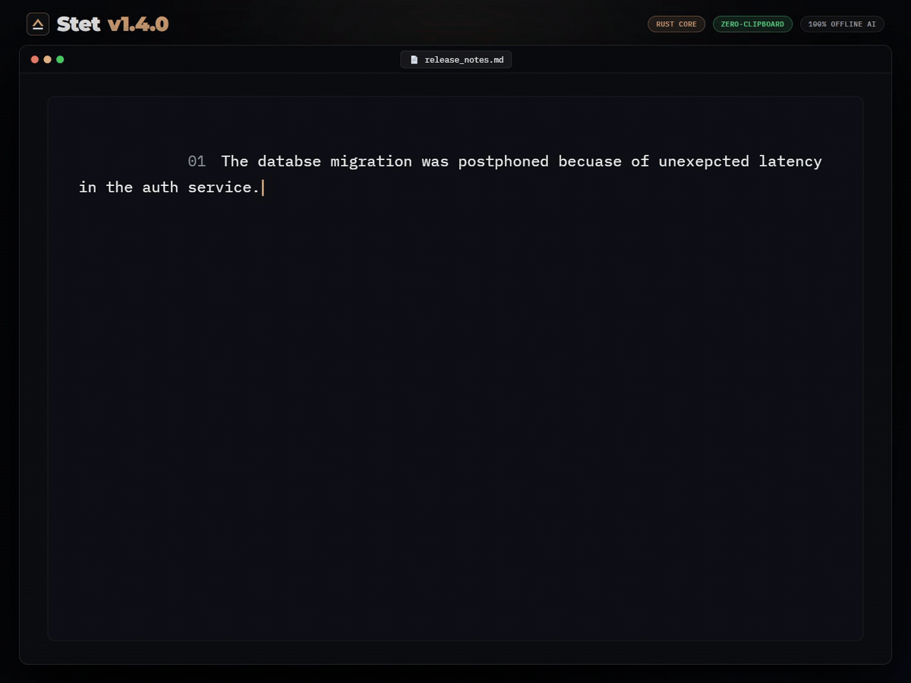
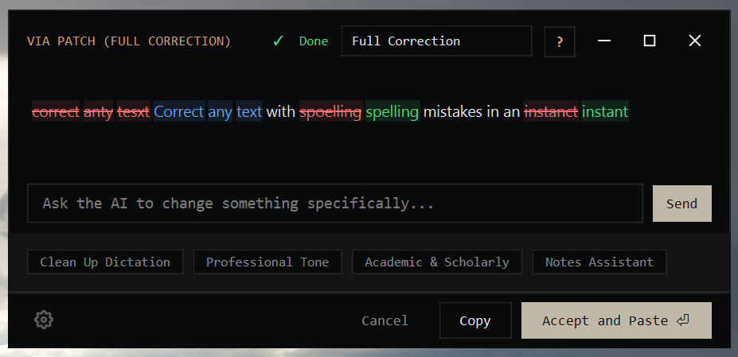
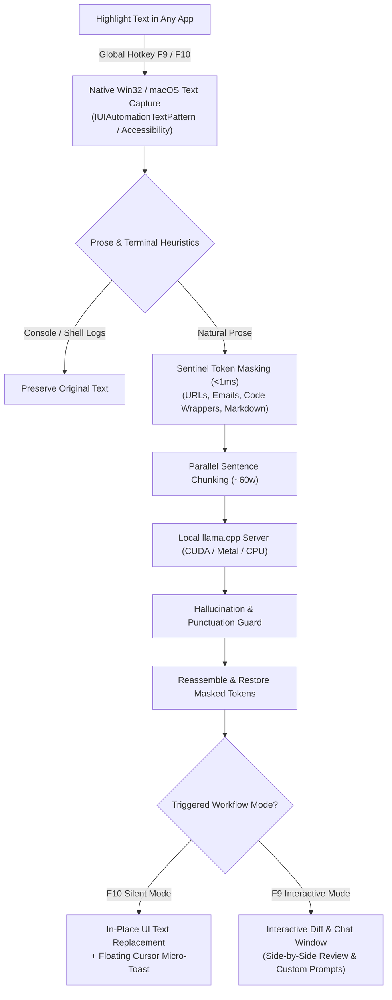

# Stet

  

  <strong>Stet: Zero-Clipboard, Local-First AI Autocorrect & Text Rewriting Utility for Windows and macOS.</strong>

  
  
  
  
  
  
  

  🛒 <strong>Gumroad:</strong> <a href="https://amrzriek.gumroad.com/l/stet">amrzriek.gumroad.com/l/stet</a> &nbsp;|&nbsp; ☕ <strong>Ko-fi:</strong> <a href="https://ko-fi.com/amrzriek">ko-fi.com/amrzriek</a> &nbsp;|&nbsp; 🚀 <strong>Latest Release:</strong> <a href="https://github.com/AmrZriek/Stet/releases/latest">Latest Installer</a>

  

---

## What is Stet?

**Stet** is a zero-clipboard, local-first AI autocorrect and text-refinement desktop application for Windows and macOS. Named after the proofreading directive *"let it stand"*, Stet allows users to select text in any application, press a global hotkey, and instantly correct typos, fix grammar, or rewrite prose in-place without overwriting active clipboard history or sending sensitive data to cloud servers.

---

## Why Stet? Key Technical Differentiators

Most AI writing assistants force users into browser extensions, cloud web apps, or rely on naive hotkey scripts (`Ctrl+C` → `Ctrl+V`) that wipe copied links, passwords, and code snippets. Stet solves these limitations through a dedicated desktop architecture:

* **Zero Clipboard Touch:** Uses native Windows UI Automation (`IUIAutomationTextPattern`) and macOS Accessibility APIs to read and rewrite text directly inside target application windows. Copied clipboard history remains completely untouched.
* **Sentinel Token Masking (<1ms):** Automatically detects and pre-tokenizes URLs (`https://...`), email addresses, file paths, code blocks, Markdown tags, and user-defined protected terms before LLM processing. Syntax, links, and identifiers are restored verbatim with 0% mangling.
* **Deterministic Dictionary Pre-Pass (<1ms):** Executes a fast dictionary lookup pass for single-word typo fixes before calling the LLM, reducing latency for minor spelling corrections.
* **100% Offline Air-Gapped Engine:** Powered by an embedded, optimized `llama.cpp` server (`llama-server`) supporting CUDA, Apple Silicon Metal, and CPU acceleration. Your drafts, internal code, and private notes never leave RAM/VRAM.
* **Parallel Sentence Chunking:** Automatically splits long selections at sentence boundaries into ~60-word chunks and runs parallel stream processing for low-latency feedback (~50ms overhead per chunk).
* **Hallucination & Punctuation Guard:** Evaluates output divergence and automatically restores trailing whitespace and punctuation dropped during LLM generation.
* **Terminal & IDE Protection:** Heuristically detects console windows (cmd, PowerShell, Windows Terminal, VS Code terminal, mintty) to prevent sending destructive `Ctrl+C` interrupt signals during text capture.

  

---

## Comparison Matrix

| Feature / Metric | Stet (Local AI) | Cloud AI (Grammarly / Copilot) | Naive Open-Source Hotkey Scripts |
| :--- | :--- | :--- | :--- |
| **Data Privacy** | 🔒 100% Offline (Local RAM/VRAM) | ❌ Cloud servers (Keystrokes transmitted) | 🔒 Local (If using local backend) |
| **Clipboard Safety** | ✅ Zero touch (Preserves copied links/passwords) | N/A (Web/App plugin) | ❌ Destroys active clipboard (`Ctrl+C/V`) |
| **Link & Code Preservation** | ✅ Sub-ms Sentinel Masking (0% mangling) | ⚠️ Partial formatting loss | ❌ Scrambles URLs, backticks, & syntax |
| **App Compatibility** | ✅ Universal (VS Code, Slack, Word, Terminal, Chrome) | ❌ Limited to supported browser/apps | ⚠️ Unreliable focus handling |
| **Speed & Overhead** | ⚡ ~50ms parallel stream chunks | ⚠️ Network latency dependent | ⚠️ Slow macro key delays |
| **Subscription Cost** | 💰 Free & Open Source | 💳 Monthly recurring fee | 💰 Free open source |

---

## Refinement Levels

Stet provides four strength profiles to match your writing requirements:

* **Level 1: Spelling Only:** Surgical typo and spelling cleanup. Preserves 100% of your original phrasing, word choice, and sentence structure.
* **Level 2: Full Correction:** Corrects grammar errors, verb tenses, prepositions, and punctuation while maintaining your personal tone.
* **Level 3: Rewrite & Polish:** Re-architects sentence flow, vocabulary, and readability for maximum clarity and impact.
* **Level 4: Custom Patch & Chat:** Applies custom system prompts (e.g., *"translate to Spanish"*, *"format as bullet points"*, *"make formal"*) or opens an interactive chat dialog with the local LLM.

---

## Installation Guide

### Windows

#### Option 1: Standalone Installer (Recommended)
1. Download `StetSetup.exe` from the [Latest Release](https://github.com/AmrZriek/Stet/releases/latest).
2. Launch the installer. If Windows SmartScreen appears, click **More info** → **Run anyway**.
3. Stet installs automatically and launches the native model downloader wizard on first run.

#### Option 2: Portable ZIP
1. Download and extract `stet_portable.zip` from [Releases](https://github.com/AmrZriek/Stet/releases).
2. Run `download_backend.bat` to fetch the `llama.cpp` server engine (~652 MB).
3. Run `download_model.bat` to fetch default GGUF model weights (~1.8 GB).
4. Run `Stet.exe`.

### macOS

1. Download `Stet-macOS.dmg` from the [Releases](https://github.com/AmrZriek/Stet/releases) page.
2. Drag **Stet.app** into your **Applications** folder.
3. On first launch, open **System Settings → Privacy & Security** and grant:
   * **Accessibility:** Required for direct UI text capture.
   * **Input Monitoring:** Required for global shortcut detection (`⌘ + ⌥ + F9` / `⌘ + ⌥ + F10`).
   * **Post Events:** Required to inject corrected text back into active windows.

---

## Key Features & Workflows

### Dual Workflow Modes

1. **Instant Silent Mode (`F10` on Win / `⌘+⌥+F10` on Mac):**
   * Highlight text and press `F10` to trigger a non-intrusive, frameless On-Screen Display indicator (`Correcting...` → `Done ✨`).
   * Replaces text instantly in-place via UI Automation without opening any window or stealing focus.
   * Supports immediate 1-key undo (`Ctrl+Z` or via the System Tray menu).

2. **Interactive Diff Window (`F9` on Win / `⌘+⌥+F9` on Mac):**
   * Opens a dark-mode window with color-coded green/red/blue diff highlights comparing original vs. corrected text.
   * **Word-Level Controls:** Right-click any changed word to *Keep my original*, *Never change this word again* (blacklist), or *Edit fix* in a popover.
   * **Plain-Text Editor:** Click **Edit text** to convert the window into an editable editor; clicking Done recalculates the diffs.
   * **Interactive Chat:** Chat directly with the local LLM to request iterative revisions or alternative phrasings.

### System Tray & Desktop Utilities

* **Model & Weight Management:** View model status and load or unload GGUF weights on demand directly from the system tray menu to free up GPU VRAM and RAM. Supports setting an automatic idle timer or unloading immediately after each use. *(Note: Detailed system-wide memory metrics can be monitored via Windows Task Manager or Activity Monitor).*
* **Correction History Viewer:** Open the built-in audit log window to search past corrections, inspect side-by-side diffs, and restore previous versions with one click.
* **Large Selection Guard:** Displays a confirmation prompt when selected text exceeds 1,000 words to prevent accidental heavy processing.
* **Native GUI Downloader:** Verifies model downloads via SHA-256 checksums before loading.
* **Security Auto-Updater:** Checks GitHub releases over HTTPS and verifies binary integrity before updating.

---

## Keyboard Shortcuts

| Action | Windows Shortcut | macOS Shortcut | Description |
| :--- | :--- | :--- | :--- |
| **Instant Silent Correction** | `F10` | `⌘ + ⌥ + F10` | Corrects selected text in-place with a floating OSD toast. |
| **Interactive Diff Window** | `F9` | `⌘ + ⌥ + F9` | Captures text and opens the side-by-side diff & chat window. |
| **Apply Correction** | `Enter` | `Enter` | Accepts edits inside the interactive diff window. |
| **Discard / Cancel** | `Escape` | `Escape` | Closes the diff window without modifying text. |

---

## Core Architecture Pipeline

```mermaid
graph TD
    A["Highlight Text in Any App"] -->|Global Hotkey F9 / F10| B["Native Win32 / macOS Text Capture<br>(IUIAutomationTextPattern / Accessibility)"]
    B --> C{"Prose & Terminal Heuristics"}
    C -->|Console / Shell Logs| D["Preserve Original Text"]
    C -->|Natural Prose| E["Sentinel Token Masking (&lt;1ms)<br>(URLs, Emails, Code Wrappers, Markdown)"]
    E --> F["Parallel Sentence Chunking (~60w)"]
    F --> G["Local llama.cpp Server (CUDA / Metal / CPU)"]
    G --> H["Hallucination & Punctuation Guard"]
    H --> I["Reassemble & Restore Masked Tokens"]
    I --> J{"Triggered Workflow Mode?"}
    J -->|F10 Silent Mode| K["In-Place UI Text Replacement<br>+ Floating Cursor Micro-Toast"]
    J -->|F9 Interactive Mode| L["Interactive Diff & Chat Window<br>(Side-by-Side Review & Custom Prompts)"]
```

---

## System Requirements & Technical Specs

* **Operating System:** Windows 10 or 11 (64-bit) / macOS 14+ (Sonoma or newer; Apple Silicon recommended).
* **Hardware Acceleration:** CUDA-compatible NVIDIA GPU (recommended for ~50ms near-instant inference) or Apple Silicon Metal GPU. CPU fallback is supported.
* **Recommended Model:** Gemma 4 E2B (Q4_K_XL UD), downloaded automatically on first launch.

---

## Frequently Asked Questions (FAQ)

### Does Stet overwrite or clear my copied clipboard text?
No. Unlike typical hotkey utilities that simulate `Ctrl+C` and `Ctrl+V`, Stet uses Windows UI Automation and macOS Accessibility APIs to read and write text directly to the active control handle. Your clipboard history (copied links, passwords, code snippets) remains completely untouched.

### How does Stet preserve URLs, code backticks, and email addresses?
Stet runs a sub-millisecond Sentinel Token Masking pass before sending text to the local LLM. URLs, email addresses, local file paths, code wrappers, and Markdown tags are replaced with unique tokens during inference and restored verbatim after processing.

### Is any text sent over the internet?
No. Stet operates 100% offline. All text processing occurs locally on your machine via an embedded `llama.cpp` server (`llama-server`) running in RAM/VRAM.

### How can I free up RAM or VRAM when I am not actively writing?
You can right-click the Stet system tray icon and choose **Unload Model** to immediately free model weights from system RAM and VRAM. Additionally, you can configure an automatic idle timer in Settings (or set it to unload immediately after each use). The model automatically reloads when you next invoke a hotkey.

### Does Stet work inside developer IDEs and terminal applications?
Yes. Stet supports VS Code, Slack, Microsoft Word, Google Chrome, Windows Terminal, Notepad, and all standard desktop inputs. For terminal windows, Stet includes built-in heuristics that prevent accidental `Ctrl+C` signal interrupts.

---

## License

Stet is open-source software distributed under the [GNU General Public License v3.0 (GPL-3.0)](LICENSE).
