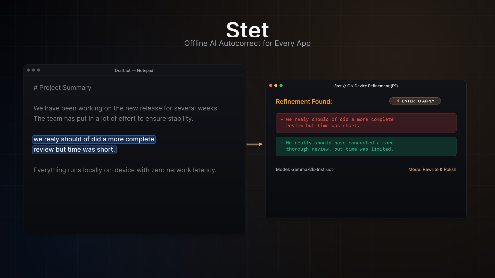
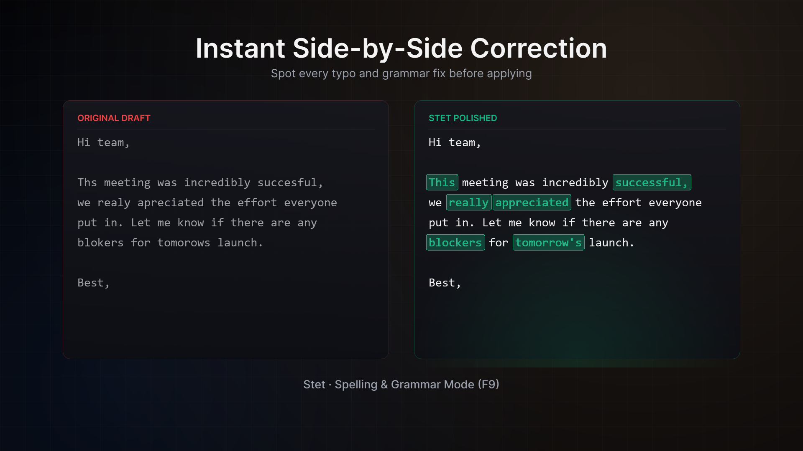
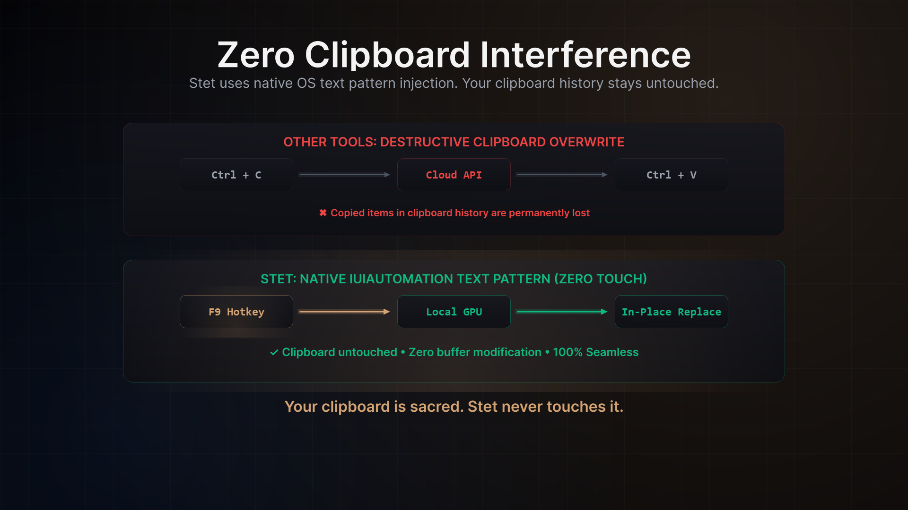
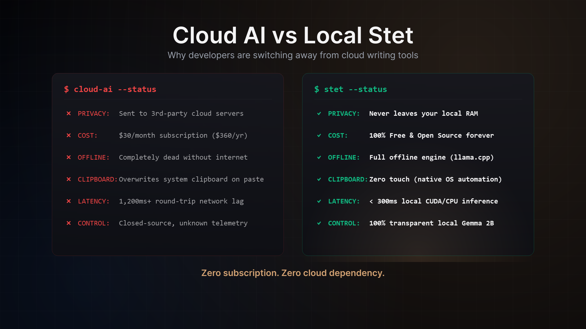
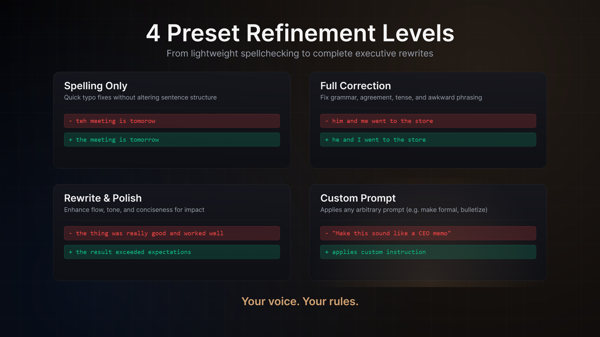
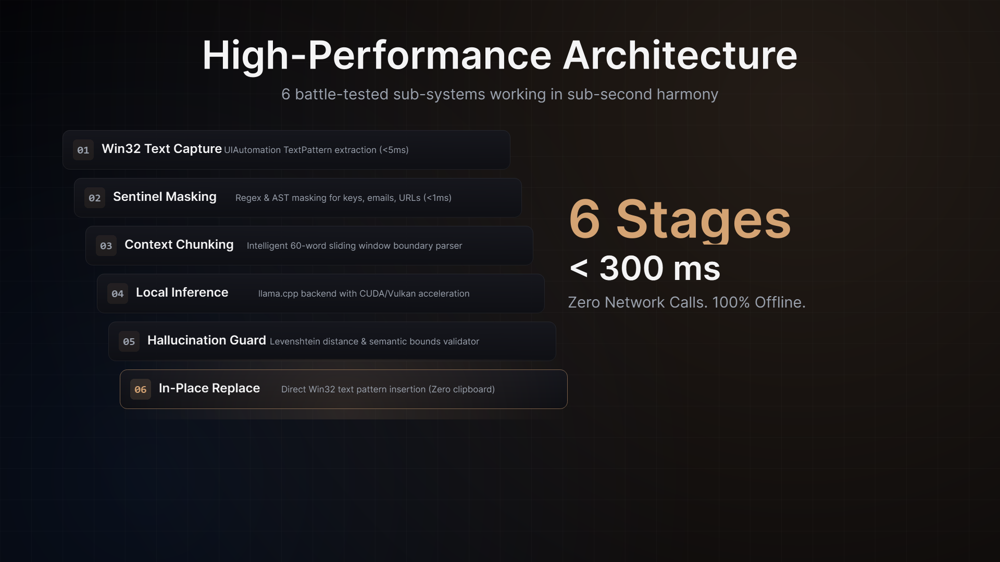
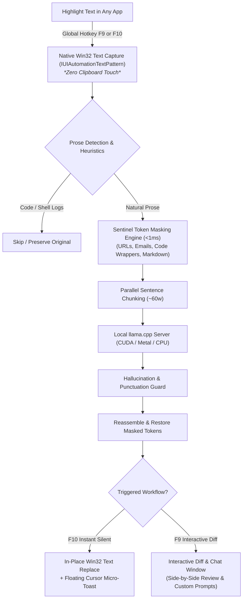
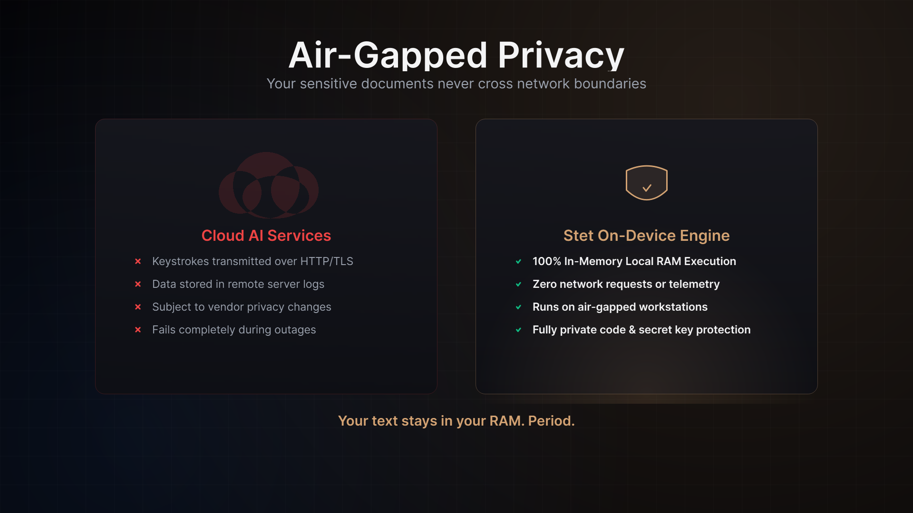
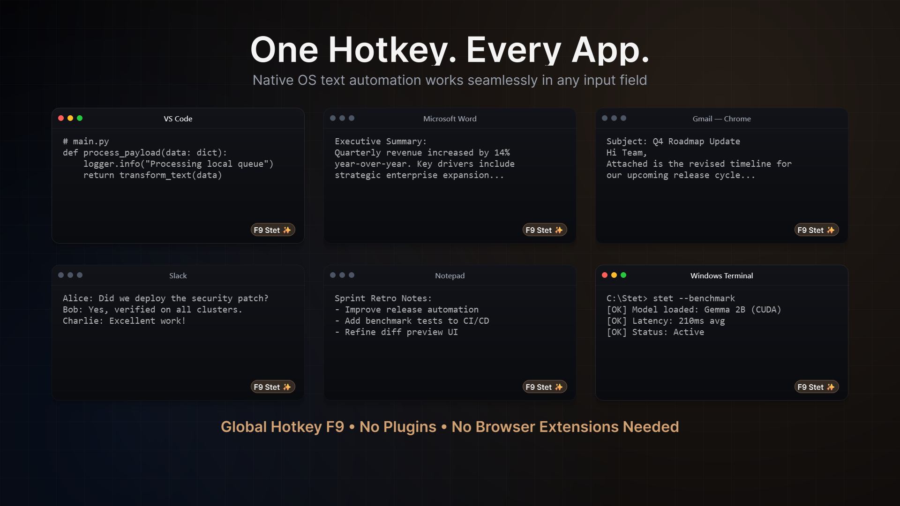

# Stet

  

  <strong>Stet</strong> is a zero-clipboard, local-first AI autocorrect and text rewriting utility for Windows (with macOS support). Select text in any desktop application, press a global hotkey, and instantly correct or rewrite it in-place without touching your clipboard or sending data to the cloud.

  
  
  
  
  

  <strong>Latest release: v1.2.0</strong> — <a href="https://github.com/AmrZriek/Stet/releases/tag/v1.2.0">Download Installer</a>

  

  

---

## 🔒 What Makes Stet Special?

In proofreading, **stet** means *"let it stand"*—a directive to preserve the author's original intent and voice. 

Most modern AI writing tools force text into generic, corporate prose while sending every keystroke to remote cloud servers. Naive open-source hotkey scripts rely on hacky `Ctrl+C` → `Ctrl+V` key simulation that destroys your active clipboard history and mangles technical links.

**Stet takes a fundamentally different engineering approach:**

* ⚡ **Zero Clipboard Contamination:** Uses native Windows UI Automation (`IUIAutomationTextPattern`) to capture and inject text directly into active UI handles. Your clipboard memory (copied links, passwords, code snippets) is **never touched or wiped**.
* 🛡️ **Ultra-Fast Sentinel Token Masking (<1ms):** Pre-tokenizes URLs (`https://...`), email addresses, local file paths, code backticks, and Markdown formatting before sending text to the AI model. Syntaxes and links are restored verbatim with 0% mangling.
* 🔒 **100% Offline Sovereignty:** Powered by a bundled, optimized `llama.cpp` inference engine (`llama-server`). Your drafts, emails, and sensitive technical documents stay strictly in your RAM/VRAM.
* ✍️ **4-Tier Strength Granularity:** From surgical typo fixes to full creative rephrasing, Stet refines your prose without homogenizing your authorial voice.
* 💨 **Parallel Sentence Chunking:** Long text is automatically split into ~60-word sentence chunks and processed in parallel streams for near-instant response times (~50ms overhead per chunk).

  

  

---

## 📊 Feature & Security Comparison Matrix

  

---

## 🎚️ 4 Preset Refinement Levels

  

* 🏷️ **Spelling Only (Level 1):** Surgical typo and spelling cleanup. Preserves 100% of your phrasing, word choice, and sentence structure.
* 📝 **Full Correction (Level 2):** Fixes grammar errors, verb tenses, prepositions, and punctuation while maintaining your original style.
* ✨ **Rewrite & Polish (Level 3):** Reworks sentence flow, vocabulary, and readability for maximum impact.
* 🔧 **Custom Patch (Level 4):** Apply custom prompt instructions (e.g. *"translate to Spanish"*, *"make formal"*, *"bulletize"*).

---

## 🚀 Core Architecture Pipeline

  

When you highlight text in any desktop app (VS Code, Slack, Word, Chrome, Notepad, or Terminal) and hit a shortcut, Stet executes a low-latency native pipeline:

```mermaid
graph TD
    A["Highlight Text in Any App"] -->|Global Hotkey F9 or F10| B["Native Win32 Text Capture (IUIAutomationTextPattern)<br><i>*Zero Clipboard Touch*</i>"]
    B --> C{"Prose Detection & Heuristics"}
    C -->|Code / Shell Logs| D["Skip / Preserve Original"]
    C -->|Natural Prose| E["Sentinel Token Masking Engine (&lt;1ms)<br>(URLs, Emails, Code Wrappers, Markdown)"]
    E --> F["Parallel Sentence Chunking (~60w)"]
    F --> G["Local llama.cpp Server (CUDA / Metal / CPU)"]
    G --> H["Hallucination & Punctuation Guard"]
    H --> I["Reassemble & Restore Masked Tokens"]
    I --> J{"Triggered Workflow?"}
    J -->|F10 Instant Silent| K["In-Place Win32 Text Replace<br>+ Floating Cursor Micro-Toast"]
    J -->|F9 Interactive Diff| L["Interactive Diff & Chat Window<br>(Side-by-Side Review & Custom Prompts)"]
```

---

## 🛡️ Air-Gapped Privacy & Universal Compatibility

  

  

---

## ✨ Comprehensive Feature Showcase

### 🎯 Dual Workflow Modes

1. **Instant Silent Mode (`F10` on Win / `⌘+⌥+F10` on Mac):**
   * Highlighting text and hitting `F10` triggers a floating, cursor-adjacent On-Screen Display toast (`Correcting...` → `Done ✨`).
   * Replaces text instantly in-place via native UI Automation without opening any window.
   * Supports immediate 1-key undo (`Ctrl+Z` / System Tray undo).
2. **Interactive Diff & Chat Window (`F9` on Win / `⌘+⌥+F9` on Mac):**
   * Opens a sleek dark-mode window with green/red diff highlights comparing original vs. corrected text.
   * Edit output manually, rerun preset templates, or chat directly with the local AI model for custom adjustments.

---

### 🛠️ Advanced Desktop Engineering Features

* **Onboarding & Welcome Window:** Draggable first-run window featuring interactive preset cards, live diff sandbox, and visual architecture flowcharts.
* **Native GUI Downloader:** Custom progress dialog for initial model weights download (~1.8 GB) with SHA-256 integrity verification, replacing CLI terminal scripts.
* **Correction History & Audit Log Window:** Search past edits, inspect side-by-side original vs. fixed text, and restore previous versions with one click.
* **System Tray Weight Manager:** Monitor VRAM usage in real time and unload model weights to free up system GPU/RAM instantly when not typing.
* **Smart Selection & Code Detection:** Automatically detects code blocks, logs, and variables using structural heuristics to prevent accidental rewriting.
* **Security-Hardened Auto-Updater:** Verifies release tag signatures, SHA-256 hashes, and HTTPS enforcement.

---

## ⌨️ Keyboard Shortcuts

| Shortcut (Windows) | Shortcut (macOS) | Action |
| :--- | :--- | :--- |
| **`F10`** | `⌘ + ⌥ + F10` | **Instant Silent Correction:** Corrects selected text in-place with micro-toast indicator. |
| **`F9`** | `⌘ + ⌥ + F9` | **Interactive Diff Window:** Captures text and opens side-by-side diff & chat popup. |
| **`Enter`** | `Enter` | **Apply Correction:** Accepts edits inside interactive diff window. |
| **`Escape`** | `Escape` | **Discard / Close:** Cancels edit window without changing text. |

---

## 📥 Installation Guide

### Windows (Primary Supported Platform)

#### Option 1: Standalone Installer (Recommended)
1. Download `StetSetup.exe` from the [Latest Release](https://github.com/AmrZriek/Stet/releases/tag/v1.2.0).
2. Run the installer. If Windows SmartScreen displays a warning, click **More info** → **Run anyway** (installer is open-source and awaiting certificate reputation).
3. The setup wizard automatically configures Stet and launches the native GUI model downloader.

#### Option 2: Portable ZIP
1. Download and extract the latest release ZIP.
2. Run `Unblock_Stet.bat` (Right-click → Run as Administrator) to clear Windows security flags on scripts.
3. Run `download_backend.bat` to fetch the `llama.cpp` engine (~652 MB, one-time).
4. Run `download_model.bat` to fetch default model weights (~1.8 GB).
5. Execute `Stet.exe` or `run.bat`.

---

### macOS

1. Download `Stet-macOS.dmg` from the [Releases](https://github.com/AmrZriek/Stet/releases) page.
2. Open the `.dmg` and drag **Stet.app** into your **Applications** folder.
3. On first launch, grant permissions in **System Settings → Privacy & Security**:
   * **Accessibility:** Required for text capture from active windows.
   * **Input Monitoring:** Required for global hotkeys (`⌘ + ⌥ + F9` / `⌘ + ⌥ + F10`).
   * **Post Events:** Required to inject corrected text back into active applications.

---

## 💻 System Requirements

* **OS:** Windows 10 or 11 (64-bit) / macOS 14+ (Apple Silicon recommended).
* **GPU:** CUDA-compatible NVIDIA GPU (recommended for ~50ms near-instant inference) or Metal GPU on Mac.
* **RAM:** 8 GB minimum (16 GB recommended).
* **Model Baseline:** Gemma 2B / Qwen 2.5 3B Instruct Q4_K_XL GGUF.

---

## 📜 License

*Stet is open-source software distributed under the GNU General Public License v3.0 (GPL-3.0).*
