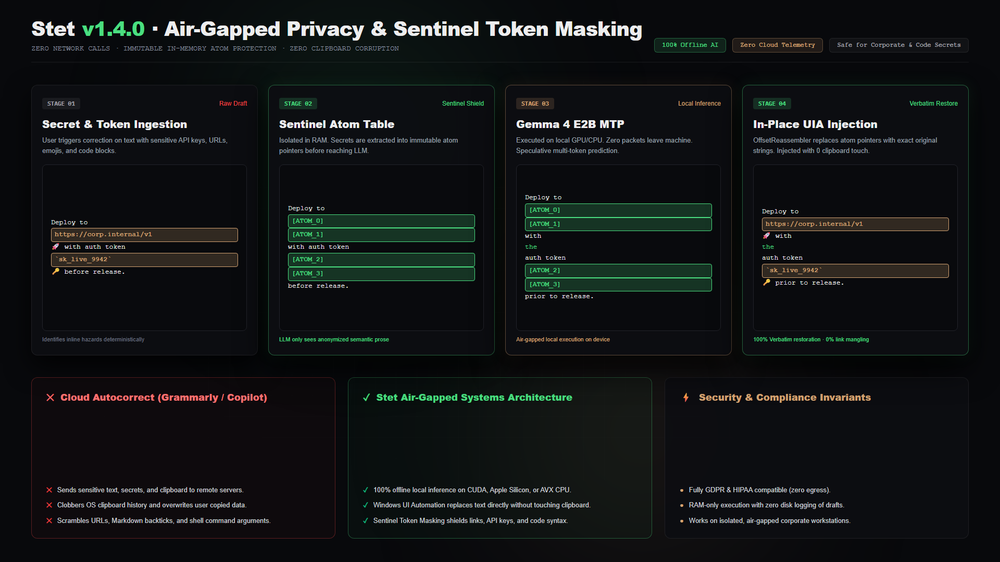
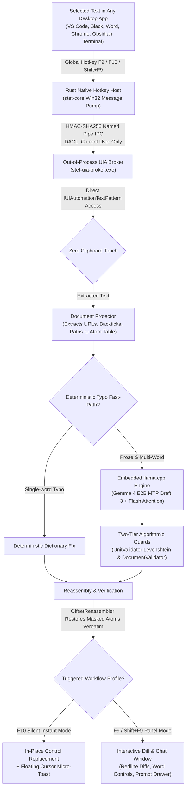
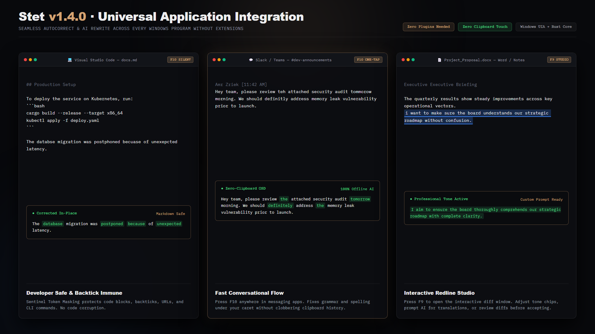
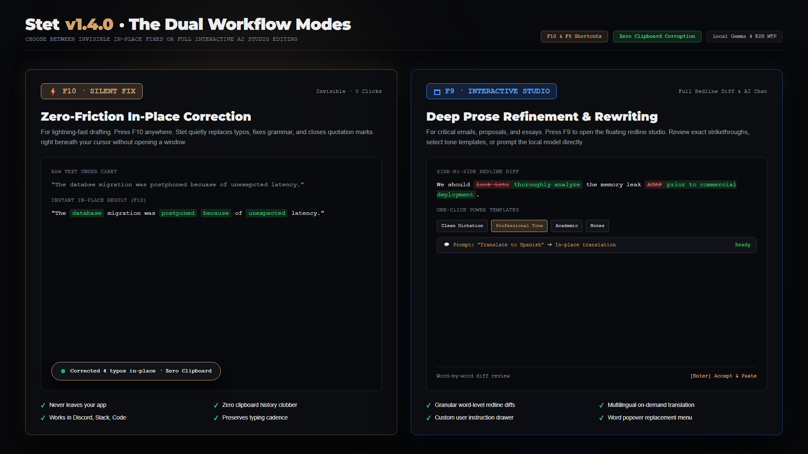
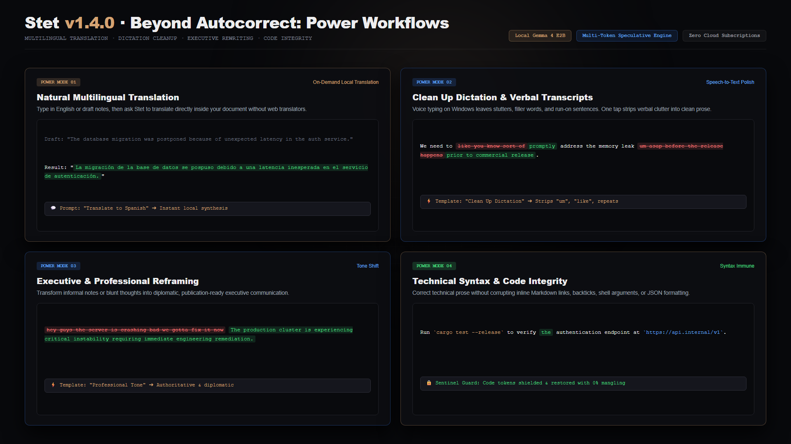
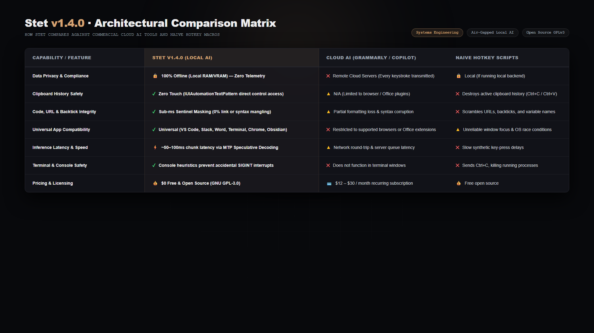

# Stet

  

  <strong>Stet: Zero-Clipboard, Local-First AI Autocorrect &amp; Prose Refinement for Windows and macOS.</strong>

  
  
  
  
  
  
  
  

  🛒 <strong>Gumroad:</strong> <a href="https://amrzriek.gumroad.com/l/stet">amrzriek.gumroad.com/l/stet</a> &nbsp;|&nbsp; ☕ <strong>Ko-fi:</strong> <a href="https://ko-fi.com/amrzriek">ko-fi.com/amrzriek</a> &nbsp;|&nbsp; 🚀 <strong>Latest Release:</strong> <a href="https://github.com/AmrZriek/Stet/releases/latest">v1.4.0 Installer</a>

  

  <video src="assets/img/stet_promo.mp4" controls="controls" width="1000" style="max-width: 100%;">
    <a href="assets/img/stet_promo.mp4">Watch Stet Promo Video</a>
  </video>

---

## What is Stet?

**Stet** is a zero-clipboard, 100% offline AI autocorrect and prose-refinement utility for desktop. Named after the universal editorial mark *"stet"* (*Latin: "let it stand"*), Stet enables writers, software engineers, and privacy-conscious professionals to select text in **any application**, press a global shortcut, and eliminate typos, fix grammar, or rewrite prose in-place—with **zero cloud data transmission**, **zero clipboard overwrites**, and **zero syntax or link mangling**.

Powered by a native **Rust core daemon** (`stet-core`), an isolated out-of-process accessibility broker (`stet-uia-broker`), and an embedded `llama.cpp` inference engine utilizing **speculative Multi-Token Prediction (MTP)**, Stet delivers near-instant corrections (~50–100ms per sentence chunk) entirely on local RAM/VRAM.

---

## Why Stet? The 7 Load-Bearing Differentiators

Most AI writing assistants force users into cloud browser extensions, third-party subscriptions, or rely on naive keyboard scripts (`Ctrl+C` → `Ctrl+V`) that wipe your clipboard and mangle code. Stet solves these architectural flaws from first principles:

  

1. **Zero-Clipboard Architecture:** Stet uses native OS accessibility patterns (`IUIAutomationTextPattern` on Windows, Accessibility APIs on macOS) to read active selections and inject replacements directly into the target control handle. Your active clipboard history (passwords, code snippets, copied links) remains 100% untouched.
2. **Sentinel Token Masking:** URLs (`https://...`), email addresses, file paths, Markdown wrappers, inline code backticks, and user-defined protected terms are pre-tokenized into an immutable atom table before LLM inference. All identifiers, emojis, and links are restored verbatim with 0% mangling.
3. **Speculative Decoding with Multi-Token Prediction (MTP):** Powered by an embedded, GPU-offloaded `llama.cpp` server running Gemma 4 E2B with MTP draft 3, Flash Attention, and Q8_0 KV cache quantization. Generates up to 3 tokens per forward pass for near-instant local inference on CUDA and Apple Silicon Metal.
4. **Out-of-Process COM Broker Crash Isolation:** All UI Automation and COM apartment calls run in a dedicated child broker (`stet-uia-broker.exe`). If a third-party application hangs its accessibility tree, Stet's main hotkey daemon never freezes.
5. **Multi-Tier Algorithmic Validation & Hallucination Gates:** Enforces temperature 0.0, structural fences (`<<<START>>>...<<<END>>>`), character edit distance checks (`UnitValidator`), and length divergence thresholds (`DocumentValidator`). Unsolicited conversational chatter or hallucinations are rejected.
6. **Terminal & Console Safety:** Heuristically detects console and terminal windows (Windows Terminal, PowerShell, cmd.exe, mintty, VS Code integrated terminal) to prevent sending disruptive `Ctrl+C` interrupt signals during capture.
7. **Dynamic VRAM Lifecycle Management:** Lightweight idle background footprint (~65MB). Model weights can be configured to automatically unload from GPU VRAM and RAM after an idle period or immediately after each use, freeing your GPU for 3D work, compilation, or gaming.

---

## Interactive Systems Architecture

The diagram below illustrates Stet's low-latency, crash-isolated pipeline:

```mermaid
graph TD
    A["Selected Text in Any Desktop App<br>(VS Code, Slack, Word, Chrome, Obsidian, Terminal)"] -->|Global Hotkey F9 / F10 / Shift+F9| B["Rust Native Hotkey Host<br>(stet-core Win32 Message Pump)"]
    B -->|HMAC-SHA256 Named Pipe IPC<br>DACL: Current User Only| C["Out-of-Process UIA Broker<br>(stet-uia-broker.exe)"]
    C -->|Direct IUIAutomationTextPattern Access| D{"Zero Clipboard Touch"}
    D -->|Extracted Text| E["Document Protector<br>(Extracts URLs, Backticks, Paths to Atom Table)"]
    E --> F{"Deterministic Typo Fast-Path?"}
    F -->|Single-word Typo| G["Deterministic Dictionary Fix"]
    F -->|Prose &amp; Multi-Word| H["Embedded llama.cpp Engine<br>(Gemma 4 E2B MTP Draft 3 + Flash Attention)"]
    G --> I["Reassembly &amp; Verification"]
    H --> J["Two-Tier Algorithmic Guards<br>(UnitValidator Levenshtein &amp; DocumentValidator)"]
    J --> I
    I -->|OffsetReassembler Restores Masked Atoms Verbatim| K{"Triggered Workflow Profile?"}
    K -->|F10 Silent Instant Mode| L["In-Place Control Replacement<br>+ Floating Cursor Micro-Toast"]
    K -->|F9 / Shift+F9 Panel Mode| M["Interactive Diff &amp; Chat Window<br>(Redline Diffs, Word Controls, Prompt Drawer)"]
```

  

---

## Dual Workflow Modes & Refinement Profiles

  

Stet provides three specialized strength profiles and four built-in power templates:

### 1. Instant Silent Mode (`F10`)
* **Workflow:** Highlight text and press `F10`. A subtle, frameless On-Screen Display indicator (`Correcting...` → `Done ✨ · Zero Clipboard`) confirms the in-place replacement.
* **Safety:** Includes 1-key instant undo (`Ctrl+Z`).

### 2. Interactive Diff Window (`F9`)
* **Workflow:** Highlight text and press `F9`. Opens a dark-mode side-by-side redline diff window comparing original vs. corrected text.
* **Word-Level Controls:** Right-click any changed word to *Keep original*, *Never change this word again (local blacklist)*, or *Edit replacement*.
* **Interactive AI Chat:** Directly prompt the local model for stylistic adjustments, tone shifts, or custom rewrites.

  

### 3. Deep Rewrite & Polish (`Shift+F9`)
* **Workflow:** Re-architects sentence flow, cadence, transitions, and clarity for maximum impact.
* **Fidelity:** Strictly preserves factual claims, numbers, technical names, and authorial intent.

### Built-In Power Templates
* 🎙️ **Clean Up Dictation:** Strips speech fillers (*"um"*, *"uh"*, *"like"*), false starts, stutters, and run-ons from voice dictation transcripts.
* 💼 **Professional Tone:** Transforms drafts into clear, direct, confident workplace communication without corporate stiffness.
* 🎓 **Academic &amp; Scholarly:** Formulates precise, objective prose with disciplined logical flow and formal transitions.
* 📝 **Notes Assistant:** Converts unstructured brain-dumps into hierarchical Markdown notes with bullet points and bold keywords.

  

---

## Keyboard Shortcuts

| Action | Windows Shortcut | macOS Shortcut | Workflow Profile |
| :--- | :--- | :--- | :--- |
| **Instant Silent Fix** | `F10` | `⌘ + ⌥ + F10` | In-place replacement with floating cursor micro-toast. |
| **Full Correction Panel** | `F9` | `⌘ + ⌥ + F9` | Opens dark-mode interactive redline diff window. |
| **Deep Rewrite &amp; Polish** | `Shift + F9` | `⌘ + ⌥ + Shift + F9` | Opens panel with deep stylistic polish engaged. |
| **Accept and Paste Edits** | `Enter` / Click | `Enter` / Click | Injects corrected text into active control. |
| **Cancel / Dismiss** | `Escape` | `Escape` | Closes window without modifying any text. |
| **Instant Undo** | `Ctrl + Z` | `⌘ + Z` | Reverts last in-place replacement immediately. |

---

## Architectural Comparison Matrix

  

| Capability / Metric | Stet v1.4.0 (Local AI) | Cloud AI (Grammarly / Copilot) | Naive Hotkey Scripts |
| :--- | :--- | :--- | :--- |
| **Data Privacy** | 🔒 **100% Air-Gapped** (Local RAM/VRAM, Zero Telemetry) | ❌ Cloud servers (Every keystroke transmitted) | 🔒 Local (If running local engine) |
| **Clipboard History Safety** | ✅ **Zero Touch** (`IUIAutomationTextPattern` direct control access) | ⚠️ N/A (Limited to browser / Office plugins) | ❌ Destroys active clipboard (`Ctrl+C` / `Ctrl+V`) |
| **Code &amp; URL Integrity** | ✅ **Sub-ms Sentinel Masking** (0% link/syntax mangling) | ⚠️ Partial formatting loss &amp; syntax corruption | ❌ Scrambles URLs, backticks, and code tokens |
| **Universal App Compatibility** | ✅ **Universal** (VS Code, Slack, Word, Terminal, Chrome, Obsidian) | ❌ Restricted to supported browsers or Office apps | ⚠️ Unreliable window focus &amp; OS race conditions |
| **Inference Latency** | ⚡ **~50–100ms** per chunk via MTP Speculative Decoding | ⚠️ Network round-trip &amp; remote queue latency | ⚠️ Slow synthetic typing pauses |
| **Terminal &amp; Shell Safety** | ✅ **Terminal heuristics** prevent accidental SIGINT interrupts | ❌ Does not function inside terminal windows | ❌ Sends `Ctrl+C`, killing active processes |
| **Pricing &amp; Licensing** | 💰 **$0 Free &amp; Open Source** (GNU GPL-3.0) | 💳 $12 – $30 / month recurring subscription | 💰 Free open source |

---

## Technical FAQ &amp; Architectural Deep Dive

### Does Stet overwrite or clear my active clipboard?
**No.** Unlike typical macro scripts that simulate `Ctrl+C` and `Ctrl+V`, Stet communicates directly with application text patterns via Windows UI Automation (`IUIAutomationTextPattern`) and macOS Accessibility APIs. The system clipboard is never touched. In rare legacy applications lacking UI Automation text patterns, Stet's guarded fallback takes an atomic snapshot of the clipboard, applies the edit, and immediately restores your original clipboard data verified by a checksum guard.

### How does Stet guarantee 0% mangling of URLs, code backticks, and paths?
Before sending text to the local LLM, Stet's sub-millisecond `DocumentProtector` extracts URLs (`https://...`), email addresses, file paths, Markdown links, and inline code backticks into an immutable atom table and replaces them with opaque sentinel markers (`<<<STET_ATOM_N>>>`). The LLM processes only natural language prose. Post-inference, the `OffsetReassembler` restores every atom verbatim, preventing broken links or altered variable names.

### Can I trust the local LLM not to hallucinate or add conversational filler?
**Yes.** All correction modes run with deterministic sampling (temperature 0.0, top_k 1), strict structural prompt fences (`<<<START>>>...<<<END>>>`), and multi-tier algorithmic divergence validators (`UnitValidator` and `DocumentValidator`). If an output exhibits conversational pleasantries (*"Sure, here is your corrected text:"*) or exceeds the configurable hallucination divergence threshold, the edit is automatically rejected.

### Will Stet hog my GPU VRAM or drain my laptop battery when idle?
**No.** Stet features dynamic VRAM and RAM lifecycle management. The background daemon uses ~65MB of idle RAM. You can configure an automatic idle timeout (e.g., 2–5 minutes) or set it to unload immediately after use. When unloaded, model weights are purged from VRAM/RAM, freeing your GPU for gaming, compilation, or 3D rendering. The model lazily reloads on your next hotkey trigger. You can also right-click the Stet system tray icon and select **Unload Model** at any time.

### How does Stet prevent COM apartment deadlocks on Windows?
All COM apartment initialization (`CoInitializeEx`) and UI Automation calls are isolated in a dedicated out-of-process broker (`stet-uia-broker.exe`). If an external third-party application freezes its accessibility tree, the broker's watchdog timer terminates the call without hanging Stet's primary process or dropping global hotkeys.

### How are inter-process communications (IPC) secured?
The local named pipe (`\\.\pipe\stet_ipc_v2`) is protected with a Windows Security Descriptor (DACL) restricting access exclusively to the current user SID. The Python GUI generates a cryptographically random 32-byte secret and transfers it to the Rust daemon over stdin during bootstrap (never exposed in command-line arguments, environment variables, or disk logs). All subsequent IPC frames are authenticated via HMAC-SHA256 framing.

---

## Installation Guide

### Windows

#### Option 1: Standalone Installer (Recommended)
1. Download `StetSetup.exe` from the [Latest Release](https://github.com/AmrZriek/Stet/releases/latest).
2. Launch the installer. If Windows SmartScreen appears, click **More info** → **Run anyway**.
3. Stet installs automatically as a native utility and launches the model downloader wizard on first run.

#### Option 2: Portable ZIP
1. Download and extract `stet_portable.zip` from [Releases](https://github.com/AmrZriek/Stet/releases).
2. Run `download_backend.bat` to fetch the optimized `llama.cpp` server.
3. Run `download_model.bat` to fetch the default Gemma 4 E2B GGUF weights (~1.8 GB).
4. Run `Stet.exe`.

### macOS

1. Download `Stet-macOS.dmg` from the [Releases](https://github.com/AmrZriek/Stet/releases) page.
2. Drag **Stet.app** into your **Applications** folder.
3. On first launch, open **System Settings → Privacy &amp; Security** and grant:
   * **Accessibility:** Required for direct UI text capture.
   * **Input Monitoring:** Required for global shortcut detection (`⌘ + ⌥ + F9` / `⌘ + ⌥ + F10`).
   * **Post Events:** Required to inject corrected text back into active windows.

---

## Hardware Requirements

* **Operating System:** Windows 10 or 11 (64-bit native MSVC) / macOS 14+ (Sonoma or newer).
* **GPU Acceleration:** NVIDIA GPU with CUDA 12+ (strongly recommended for sub-100ms inference) or Apple Silicon Metal GPU (M1/M2/M3/M4).
* **CPU Fallback:** Multi-core x86_64 CPU with AVX2 support is supported out of the box.
* **Memory:** 8 GB system RAM minimum (16 GB recommended).
* **Storage:** ~2.5 GB free disk space for engine and GGUF model weights.
* **Recommended Model:** Gemma 4 E2B (Q4_K_XL UD) with Multi-Token Prediction (MTP draft 3), downloaded automatically on first launch.

---

## License

Stet is free, open-source software distributed under the [GNU General Public License v3.0 (GPL-3.0)](LICENSE).
